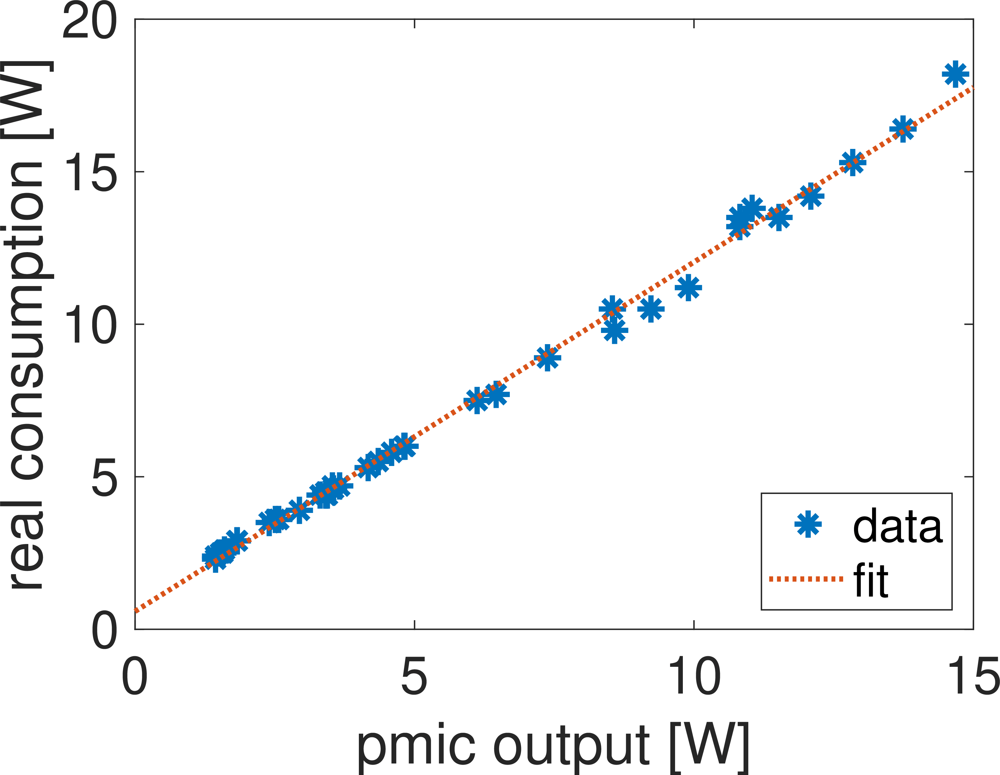

# RPi5-power
Simple script measuring the consumption of Raspberry Pi 5 in Watts

The Raspberry Pi 5 comes with PMIC (power management integrated circuit) which gives you tensions and currents in 12 branches. It does not measure the total consumption, as there are apparently some branches not connected to PMIC. But we can estimate the power consumption of RPi5 by summing the consumption of the 12 branches.

The command to read PMIC is

```
$ vcgencmd pmic_read_adc
 3V7_WL_SW_A current(0)=0.00000000A
   3V3_SYS_A current(1)=0.06245952A
   1V8_SYS_A current(2)=0.16102850A
  DDR_VDD2_A current(3)=0.00780744A
  DDR_VDDQ_A current(4)=0.00000000A
   1V1_SYS_A current(5)=0.17566740A
    0V8_SW_A current(6)=0.32791250A
  VDD_CORE_A current(7)=10.87674000A
   3V3_DAC_A current(17)=0.00036630A
   3V3_ADC_A current(18)=0.00042735A
   0V8_AON_A current(16)=0.00579975A
      HDMI_A current(22)=0.01367520A
 3V7_WL_SW_V volt(8)=3.79999600V
   3V3_SYS_V volt(9)=3.30632200V
   1V8_SYS_V volt(10)=1.79828900V
  DDR_VDD2_V volt(11)=1.10292900V
  DDR_VDDQ_V volt(12)=0.60476130V
   1V1_SYS_V volt(13)=1.10439400V
    0V8_SW_V volt(14)=0.80256330V
  VDD_CORE_V volt(15)=0.89745940V
   3V3_DAC_V volt(20)=3.30494200V
   3V3_ADC_V volt(21)=3.30219400V
   0V8_AON_V volt(19)=0.79736190V
      HDMI_V volt(23)=5.07056000V
     EXT5V_V volt(24)=5.06788000V
      BATT_V volt(25)=3.01110800V
```

The last two lines are ignored for our purpose as it gives the input tension and RTC battery tension with no corresponding currents. The readings tend to fluctuate a lot. So I'm doing an average over 50 seconds with the measurements every second.

As said before, the sum of the 12 branches is lower than the total consumption of the RPi5. But one can measure the real consumption of the RPi5 by a USB-C power-meter for different loads and then compare it to the output of the script.

It looks like a simple linear correction is enough to get the real power consumption. According to my measurement it is real_consumption [W] = pmic_output [W] * 1.1327 + 0.6444


